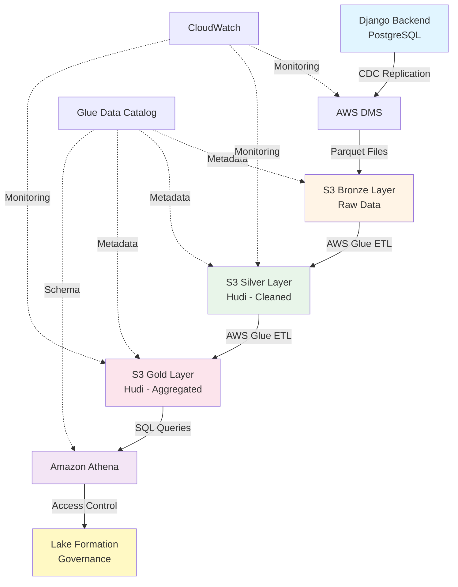
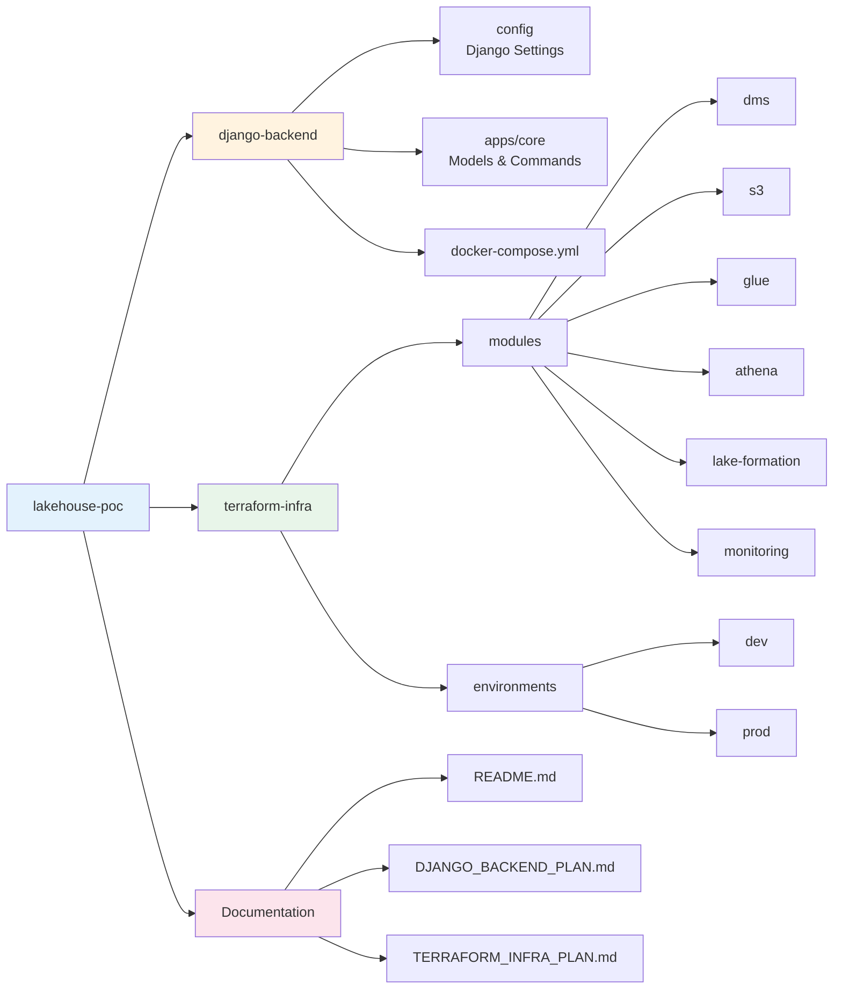

# Lakehouse POC - Multi-Tenant Data Architecture

A proof-of-concept implementation of a modern data lakehouse architecture using AWS services, demonstrating CDC replication, medallion architecture, and multi-tenant analytics.

## Project Overview

This project showcases a complete data architecture solution for a multi-tenant SaaS platform, replicating data from a PostgreSQL database to AWS S3, transforming it through Bronze/Silver/Gold layers, and enabling analytics via Amazon Athena.

**Primary Goal**: Demonstrate the effectiveness, cost, and performance of AWS DMS for database replication and lakehouse architecture for historical metrics across multiple clients.

## Architecture



## Key Features

- **Multi-Tenant Isolation**: Row-level security via AWS Lake Formation
- **Real-Time CDC**: Change Data Capture with AWS DMS (< 5 second latency)
- **Medallion Architecture**: Bronze (raw) → Silver (cleaned) → Gold (aggregated)
- **ACID Transactions**: Apache Hudi for upserts and time-travel queries
- **Cost-Optimized**: Partitioning, compression, and lifecycle policies
- **Scalable**: Handles millions of records across multiple tenants

## Technology Stack

### Data Source
- **Django 4.2+**: Multi-tenant SaaS application
- **PostgreSQL 15+**: Source database with logical replication
- **Docker**: Containerized development environment

### AWS Services
- **AWS DMS**: Database replication (full load + CDC)
- **Amazon S3**: Data lake storage (Bronze/Silver/Gold)
- **AWS Glue**: ETL jobs, crawlers, and data catalog
- **Apache Hudi**: ACID transactions and incremental processing
- **Amazon Athena**: Serverless SQL queries
- **AWS Lake Formation**: Data governance and access control
- **CloudWatch**: Monitoring and alerting

### Infrastructure as Code
- **Terraform**: Complete AWS infrastructure provisioning
- **Modular Design**: Reusable modules for each service

## Project Structure



## Data Models

The Django backend simulates an e-commerce SaaS platform with 8 core models:

1. **Tenant**: Client organizations (8-10 tenants)
2. **Customer**: End users per tenant (5K-10K total)
3. **Product**: Items/services offered (500-1K per tenant)
4. **Order**: Purchase transactions (50K-100K total)
5. **OrderItem**: Line items (150K-300K total)
6. **Event**: User activity logs (500K-1M events)
7. **Subscription**: Recurring revenue tracking (2K-5K)
8. **Invoice**: Billing records (10K-20K)

**Data Volume**: 6 months of historical data with realistic patterns (seasonality, growth trends, customer behavior)

## Key Metrics Enabled

### Revenue Analytics
- Total revenue by tenant over time
- Average order value trends
- Revenue growth rate (MoM, QoQ)
- Product category performance

### Customer Analytics
- Customer acquisition trends
- Customer lifetime value (LTV)
- Retention and churn rates
- Cohort analysis

### Product Analytics
- Best-selling products by tenant
- Inventory turnover
- Product profitability
- Category trends

### Behavioral Analytics
- Conversion funnel analysis
- Session duration and engagement
- Cart abandonment rates
- User journey mapping

### Subscription Analytics
- Monthly Recurring Revenue (MRR)
- Annual Recurring Revenue (ARR)
- Subscription churn rate
- Plan distribution

## Implementation Timeline

### Phase 1: Django Backend (4-5 days)
- Set up Django project with PostgreSQL
- Implement 8 core models with multi-tenant support
- Create data generation scripts (Faker, Factory Boy)
- Generate 100K+ records with 6 months of history
- Enable PostgreSQL logical replication

### Phase 2: Terraform Infrastructure (7-8 days)
- Provision AWS networking and IAM
- Set up DMS replication (PostgreSQL → S3)
- Create S3 buckets with medallion architecture
- Implement Glue ETL jobs (Bronze → Silver → Gold)
- Configure Athena workgroups and queries
- Set up Lake Formation governance
- Enable monitoring and alerting

### Total Duration: 11-13 days

## Cost Estimation

**Development Environment**: ~$165/month
- AWS DMS: $70/month (t3.medium instance)
- S3 Storage: $7/month (100 GB across layers)
- AWS Glue: $46/month (crawlers + ETL jobs)
- Amazon Athena: $0.50/month (100 GB scanned)
- CloudWatch: $10/month (logs and metrics)
- Networking: $32/month (NAT Gateway if needed)

**Cost Optimization**:
- Stop DMS instance when not testing
- Use S3 lifecycle policies (IA, Glacier)
- Implement partition pruning in Athena
- Use Glue job bookmarks to avoid reprocessing

## Non-Functional Requirements

### Performance
- **DMS Latency**: < 5 seconds for CDC
- **Glue Jobs**: < 10 minutes for daily transformations
- **Athena Queries**: < 15 seconds for complex joins
- **Data Freshness**: < 10 minutes from source to Silver layer

### Reliability
- **DMS Uptime**: 99.9%
- **Glue Job Success Rate**: > 95%
- **Data Quality**: > 99% valid records

### Scalability
- Support 1M+ records
- Handle 20+ tenants
- Process 1+ year of historical data
- Support 10+ concurrent Athena queries

## Demo Scenarios

### 1. Real-Time CDC
Insert a new order in Django → Show DMS replication → Query in Athena (< 10 seconds end-to-end)

### 2. Historical Analysis
Query 6 months of revenue trends across all tenants with partition pruning

### 3. Multi-Tenant Isolation
Demonstrate row-level security with Lake Formation (Tenant A analyst can only see Tenant A data)

### 4. Time Travel
Query Hudi table state from 1 week ago for data recovery scenarios

### 5. Cost Optimization
Compare query costs and performance across Bronze/Silver/Gold layers

## Getting Started

### Prerequisites
- AWS Account with appropriate permissions
- Docker and Docker Compose installed
- Terraform 1.5+ installed
- Python 3.11+ installed
- PostgreSQL client tools

### Quick Start

1. **Clone the repository**
   ```bash
   git clone <repository-url>
   cd lakehouse-poc
   ```

2. **Set up Django backend**
   ```bash
   cd django-backend
   cp .env.example .env
   docker-compose up -d
   python manage.py migrate
   python manage.py seed_all --scale medium
   ```

3. **Provision AWS infrastructure**
   ```bash
   cd ../terraform-infra/environments/dev
   cp terraform.tfvars.example terraform.tfvars
   # Edit terraform.tfvars with your configuration
   terraform init
   terraform plan
   terraform apply
   ```

4. **Verify data flow**
   - Check DMS replication task status
   - Run Glue crawlers
   - Execute sample Athena queries

## Documentation

- [Django Backend Implementation Plan](./DJANGO_BACKEND_PLAN.md) - Detailed Django setup and data generation
- [Terraform Infrastructure Plan](./TERRAFORM_INFRA_PLAN.md) - Complete AWS architecture and modules
- [Architecture Diagrams](./docs/ARCHITECTURE.md) - Visual representations (to be created)
- [Deployment Guide](./docs/DEPLOYMENT.md) - Step-by-step deployment instructions (to be created)
- [Cost Analysis](./docs/COST_ESTIMATION.md) - Detailed cost breakdown (to be created)
- [Troubleshooting](./docs/TROUBLESHOOTING.md) - Common issues and solutions (to be created)

## Security Considerations

- **Encryption**: All data encrypted at rest (S3 SSE) and in transit (TLS)
- **Access Control**: IAM roles with least privilege principle
- **Multi-Tenant Isolation**: Lake Formation row-level security
- **Secrets Management**: AWS Secrets Manager for database credentials
- **Audit Logging**: CloudTrail for all API calls
- **Network Security**: VPC with private subnets and security groups

## Future Enhancements

- **BI Dashboards**: Connect Tableau or Amazon QuickSight
- **Data Quality**: Implement Great Expectations or AWS Deequ
- **ML Pipeline**: Add SageMaker for predictive analytics
- **Real-Time Streaming**: Integrate Kinesis for sub-second latency
- **Multi-Region**: Disaster recovery and global distribution
- **Data Versioning**: Enhanced Hudi configurations for compliance
- **Automated Testing**: Terraform tests and data validation pipelines

## Contributing

This is a proof-of-concept project for a residency program. Contributions and suggestions are welcome.

## License

[Specify your license here]

## Contact

[Your contact information]

---

**Note**: This is a demonstration project designed to showcase modern data architecture patterns. For production use, additional hardening, testing, and optimization would be required.
