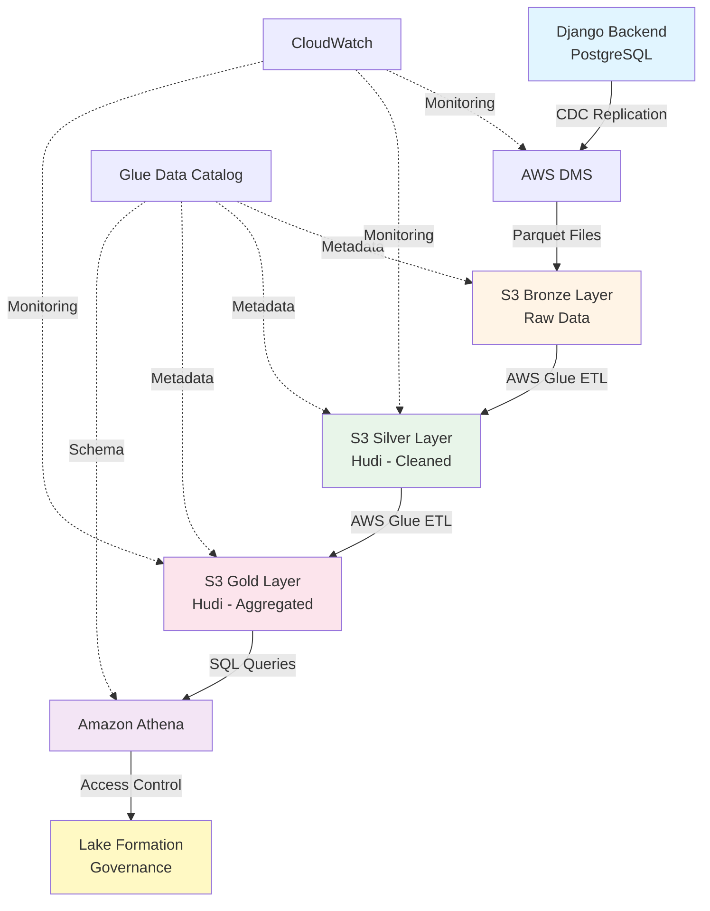
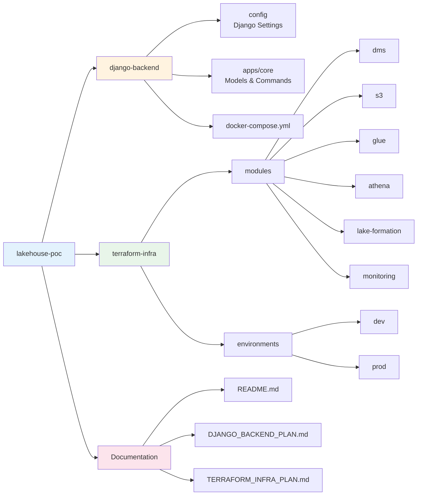

# Lakehouse POC - Multi-Tenant Data Architecture

A proof-of-concept implementation of a modern data lakehouse architecture using AWS services, demonstrating CDC replication, medallion architecture, and multi-tenant analytics.

## Project Overview

This project showcases a complete data architecture solution for a multi-tenant SaaS platform, replicating data from a PostgreSQL database to AWS S3, transforming it through Bronze/Silver/Gold layers, and enabling analytics via Amazon Athena.

**Primary Goal**: Demonstrate the effectiveness, cost, and performance of AWS DMS for database replication and lakehouse architecture for historical metrics across multiple clients.

## Architecture



## Key Features

- **Multi-Tenant Isolation**: Row-level security via AWS Lake Formation
- **Real-Time CDC**: Change Data Capture with AWS DMS (< 5 second latency)
- **Medallion Architecture**: Bronze (raw) → Silver (cleaned) → Gold (aggregated)
- **ACID Transactions**: Apache Hudi for upserts and time-travel queries
- **Cost-Optimized**: Partitioning, compression, and lifecycle policies
- **Scalable**: Handles millions of records across multiple tenants

## Technology Stack

### Data Source
- **Django 4.2+**: Multi-tenant SaaS application
- **PostgreSQL 15+**: Source database with logical replication
- **Docker**: Containerized development environment

### AWS Services
- **AWS DMS**: Database replication (full load + CDC)
- **Amazon S3**: Data lake storage (Bronze/Silver/Gold)
- **AWS Glue**: ETL jobs, crawlers, and data catalog
- **Apache Hudi**: ACID transactions and incremental processing
- **Amazon Athena**: Serverless SQL queries
- **AWS Lake Formation**: Data governance and access control
- **CloudWatch**: Monitoring and alerting

### Infrastructure as Code
- **Terraform**: Complete AWS infrastructure provisioning
- **Modular Design**: Reusable modules for each service

## Project Structure



## Data Models

The Django backend simulates an e-commerce SaaS platform with 8 core models:

1. **Tenant**: Client organizations (8-10 tenants)
2. **Customer**: End users per tenant (5K-10K total)
3. **Product**: Items/services offered (500-1K per tenant)
4. **Order**: Purchase transactions (50K-100K total)
5. **OrderItem**: Line items (150K-300K total)
6. **Event**: User activity logs (500K-1M events)
7. **Subscription**: Recurring revenue tracking (2K-5K)
8. **Invoice**: Billing records (10K-20K)

**Data Volume**: 6 months of historical data with realistic patterns (seasonality, growth trends, customer behavior)

## Key Metrics Enabled

### Revenue Analytics
- Total revenue by tenant over time
- Average order value trends
- Revenue growth rate (MoM, QoQ)
- Product category performance

### Customer Analytics
- Customer acquisition trends
- Customer lifetime value (LTV)
- Retention and churn rates
- Cohort analysis

### Product Analytics
- Best-selling products by tenant
- Inventory turnover
- Product profitability
- Category trends

### Behavioral Analytics
- Conversion funnel analysis
- Session duration and engagement
- Cart abandonment rates
- User journey mapping

### Subscription Analytics
- Monthly Recurring Revenue (MRR)
- Annual Recurring Revenue (ARR)
- Subscription churn rate
- Plan distribution

## Implementation Timeline

### Phase 1: Django Backend (4-5 days)
- Set up Django project with PostgreSQL
- Implement 8 core models with multi-tenant support
- Create data generation scripts (Faker, Factory Boy)
- Generate 100K+ records with 6 months of history
- Enable PostgreSQL logical replication

### Phase 2: Terraform Infrastructure (7-8 days)
- Provision AWS networking and IAM
- Set up DMS replication (PostgreSQL → S3)
- Create S3 buckets with medallion architecture
- Implement Glue ETL jobs (Bronze → Silver → Gold)
- Configure Athena workgroups and queries
- Set up Lake Formation governance
- Enable monitoring and alerting

### Total Duration: 11-13 days

## Cost Estimation

**Development Environment**: ~$165/month
- AWS DMS: $70/month (t3.medium instance)
- S3 Storage: $7/month (100 GB across layers)
- AWS Glue: $46/month (crawlers + ETL jobs)
- Amazon Athena: $0.50/month (100 GB scanned)
- CloudWatch: $10/month (logs and metrics)
- Networking: $32/month (NAT Gateway if needed)

**Cost Optimization**:
- Stop DMS instance when not testing
- Use S3 lifecycle policies (IA, Glacier)
- Implement partition pruning in Athena
- Use Glue job bookmarks to avoid reprocessing

## Non-Functional Requirements

### Performance
- **DMS Latency**: < 5 seconds for CDC
- **Glue Jobs**: < 10 minutes for daily transformations
- **Athena Queries**: < 15 seconds for complex joins
- **Data Freshness**: < 10 minutes from source to Silver layer

### Reliability
- **DMS Uptime**: 99.9%
- **Glue Job Success Rate**: > 95%
- **Data Quality**: > 99% valid records

### Scalability
- Support 1M+ records
- Handle 20+ tenants
- Process 1+ year of historical data
- Support 10+ concurrent Athena queries

## Demo Scenarios

### 1. Real-Time CDC
Insert a new order in Django → Show DMS replication → Query in Athena (< 10 seconds end-to-end)

### 2. Historical Analysis
Query 6 months of revenue trends across all tenants with partition pruning

### 3. Multi-Tenant Isolation
Demonstrate row-level security with Lake Formation (Tenant A analyst can only see Tenant A data)

### 4. Time Travel
Query Hudi table state from 1 week ago for data recovery scenarios

### 5. Cost Optimization
Compare query costs and performance across Bronze/Silver/Gold layers

## Getting Started

### Prerequisites

**Required:**
- Docker Desktop installed ([Download](https://www.docker.com/products/docker-desktop))
- Docker Compose (included with Docker Desktop)
- Git (to clone the repository)

**For Step 2 (Terraform):**
- AWS Account with appropriate permissions
- Terraform 1.5+ installed
- AWS CLI configured

### Step-by-Step Setup

#### 1. Clone the Repository

```bash
git clone <repository-url>
cd lakehouse-poc
```

#### 2. Start Django Backend

```bash
# Navigate to Django backend directory
cd django-backend

# Copy environment file (optional - defaults work for local development)
cp .env.example .env

# Start Docker containers (PostgreSQL + Django)
docker-compose up -d

# Wait for services to be ready (about 10 seconds)
# You can check status with:
docker-compose ps
```

#### 3. Initialize Database

```bash
# Create database tables
docker-compose exec django python manage.py migrate

# Create admin user for Django admin panel
docker-compose exec django python manage.py createsuperuser
# Enter username: admin
# Enter email: admin@example.com
# Enter password: (your choice, minimum 8 characters)
```

#### 4. Generate Sample Data

```bash
# Seed data with medium scale (recommended for demo)
docker-compose exec django python manage.py seed_all --scale medium

# This will create:
# - 8 tenants
# - 6,400 customers
# - 800 products
# - ~48,000 orders
# - ~293,000 events
# - 1,920 subscriptions
# - ~19,000 invoices
# 
# Time: ~2-3 minutes
```

**Available scales:**
- `--scale small`: ~17K total records (~30 seconds)
- `--scale medium`: ~540K total records (~2-3 minutes) ⭐ Recommended
- `--scale large`: ~3M total records (~10-15 minutes)

#### 5. Configure PostgreSQL for DMS

```bash
# Create publication for AWS DMS replication
docker-compose exec postgres psql -U lakehouse_user -d lakehouse_poc \
  -c "CREATE PUBLICATION dms_publication FOR ALL TABLES;"

# Verify publication was created
docker-compose exec postgres psql -U lakehouse_user -d lakehouse_poc -c "\dRp+"
```

#### 6. Verify Installation

```bash
# Check data was created
docker-compose exec postgres psql -U lakehouse_user -d lakehouse_poc -c \
  "SELECT 'tenants' as table_name, COUNT(*) FROM core_tenant 
   UNION ALL SELECT 'customers', COUNT(*) FROM core_customer 
   UNION ALL SELECT 'orders', COUNT(*) FROM core_order;"

# Access Django admin panel
open http://localhost:8000/admin
# Login with the superuser credentials you created
```

### Troubleshooting Setup

**Docker containers won't start:**
```bash
# Check if ports 5432 or 8000 are already in use
lsof -i :5432
lsof -i :8000

# Stop any conflicting services or change ports in docker-compose.yml
```

**PostgreSQL connection errors:**
```bash
# Check PostgreSQL is ready
docker-compose exec postgres pg_isready -U lakehouse_user

# View PostgreSQL logs
docker-compose logs postgres
```

**Migration errors:**
```bash
# Reset database and start fresh
docker-compose down -v
docker-compose up -d
sleep 10
docker-compose exec django python manage.py migrate
```

**Out of disk space:**
```bash
# Clean up Docker resources
docker system prune -a --volumes

# Or increase Docker Desktop disk allocation:
# Docker Desktop → Settings → Resources → Disk image size
```

### What You'll Have After Setup

✅ **Running Services:**
- PostgreSQL 15 with logical replication enabled
- Django 4.2 application with admin interface
- 8 data models representing multi-tenant e-commerce platform

✅ **Sample Data:**
- Multi-tenant data across 8 organizations
- 6 months of historical data
- Realistic distributions and patterns
- Ready for AWS DMS replication

✅ **Access Points:**
- Django Admin: http://localhost:8000/admin
- PostgreSQL: localhost:5432 (database: lakehouse_poc)
- API: http://localhost:8000 (if you add endpoints)

### Next Steps After Setup

1. **Explore the data** in Django admin
2. **Run sample SQL queries** (see [Quick Reference](./QUICK_REFERENCE.md))
3. **Verify data quality** and distributions
4. **Document connection details** for Terraform
5. **Proceed to Step 2**: Terraform infrastructure implementation

See [Django Backend README](./django-backend/README.md) for detailed usage instructions.

### Terraform Infrastructure (Step 2)

Coming soon - After Django backend is running and generating data.

```bash
cd terraform-infra/environments/dev
cp terraform.tfvars.example terraform.tfvars
# Edit terraform.tfvars with your AWS configuration
terraform init
terraform plan
terraform apply
```

See [Terraform Infrastructure Plan](./docs/TERRAFORM_INFRA_PLAN.md) for detailed architecture.

## Documentation

- **[Environment Replication Guide](./REPLICATION_GUIDE.md)** - Complete step-by-step setup instructions ⭐
- [Django Backend README](./django-backend/README.md) - Django usage and commands
- [Quick Reference Guide](./QUICK_REFERENCE.md) - Common commands and SQL queries
- [Django Backend Implementation Plan](./docs/DJANGO_BACKEND_PLAN.md) - Detailed Django architecture
- [Terraform Infrastructure Plan](./docs/TERRAFORM_INFRA_PLAN.md) - AWS architecture and modules
- [Implementation Status](./IMPLEMENTATION_STATUS.md) - Project progress tracker

## Security Considerations

- **Encryption**: All data encrypted at rest (S3 SSE) and in transit (TLS)
- **Access Control**: IAM roles with least privilege principle
- **Multi-Tenant Isolation**: Lake Formation row-level security
- **Secrets Management**: AWS Secrets Manager for database credentials
- **Audit Logging**: CloudTrail for all API calls
- **Network Security**: VPC with private subnets and security groups

## Future Enhancements

- **BI Dashboards**: Connect Tableau or Amazon QuickSight
- **Data Quality**: Implement Great Expectations or AWS Deequ
- **ML Pipeline**: Add SageMaker for predictive analytics
- **Real-Time Streaming**: Integrate Kinesis for sub-second latency
- **Multi-Region**: Disaster recovery and global distribution
- **Data Versioning**: Enhanced Hudi configurations for compliance
- **Automated Testing**: Terraform tests and data validation pipelines

## Contributing

This is a proof-of-concept project for a residency program. Contributions and suggestions are welcome.

## License

[Specify your license here]

## Common Issues & Solutions

### Issue: "relation core_tenant does not exist"
**Solution:** You need to run migrations first
```bash
docker-compose exec django python manage.py migrate
```

### Issue: "duplicate key value violates unique constraint"
**Solution:** Clean existing data before reseeding
```bash
docker-compose exec django python manage.py seed_all --scale medium --clean
```

### Issue: Docker containers keep restarting
**Solution:** Check logs and ensure PostgreSQL is healthy
```bash
docker-compose logs postgres
docker-compose logs django
# Wait for PostgreSQL to be fully ready before running migrations
```

### Issue: Slow data generation
**Solution:** 
- Use `--scale small` for testing
- Ensure Docker has enough resources (4GB+ RAM recommended)
- Check Docker Desktop settings: Resources → Advanced

### Issue: Can't connect to PostgreSQL from host machine
**Solution:** Ensure port 5432 is exposed and not blocked
```bash
# Test connection
psql -h localhost -p 5432 -U lakehouse_user -d lakehouse_poc

# If using a different port, update docker-compose.yml
```

### Issue: Django admin shows "CSRF verification failed"
**Solution:** Clear browser cookies or use incognito mode

## Useful Commands Reference

```bash
# Start services
docker-compose up -d

# Stop services
docker-compose down

# View logs
docker-compose logs -f

# Restart a service
docker-compose restart django

# Access Django shell
docker-compose exec django python manage.py shell_plus

# Connect to PostgreSQL
docker-compose exec postgres psql -U lakehouse_user -d lakehouse_poc

# Backup database
docker-compose exec postgres pg_dump -U lakehouse_user lakehouse_poc > backup.sql

# Check data counts
docker-compose exec postgres psql -U lakehouse_user -d lakehouse_poc -c \
  "SELECT 'orders' as table, COUNT(*) FROM core_order;"
```

## Project Status

- ✅ **Django Backend (Step 1)**: Complete and tested
- 🚧 **Terraform Infrastructure (Step 2)**: Planned (see [Terraform Plan](./docs/TERRAFORM_INFRA_PLAN.md))

## Contact

[Your contact information]

---

**Note**: This is a demonstration project designed to showcase modern data architecture patterns. For production use, additional hardening, testing, and optimization would be required.
